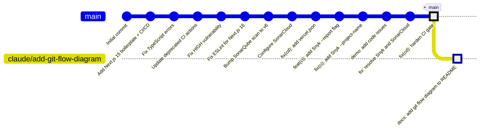
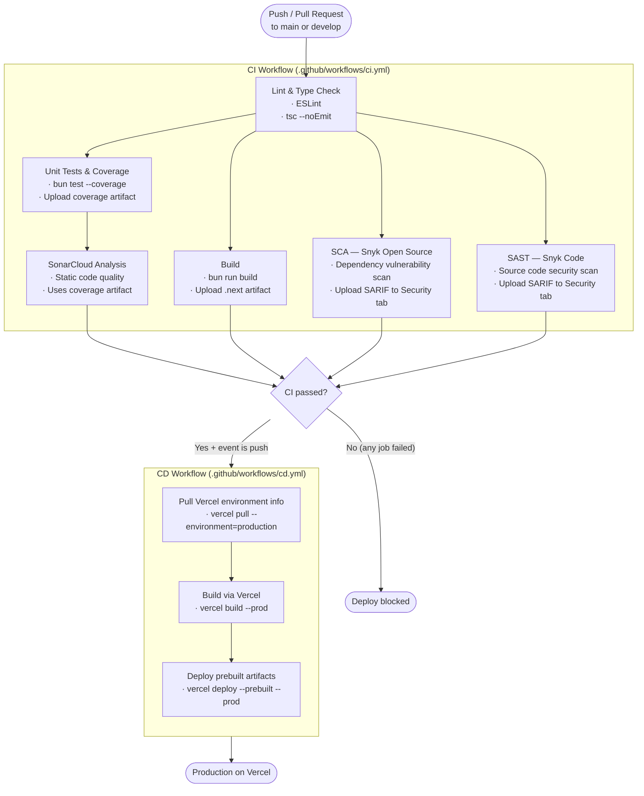

# Next.js Coding Sandbox

A Next.js 15 boilerplate with Tailwind v4, Bun test runner, and full CI/CD pipelines including security scanning and automated deployment to Vercel.

## Tech Stack

| Layer | Tool |
|---|---|
| Framework | Next.js 16 (App Router) |
| Runtime / Package Manager | Bun |
| Styling | Tailwind CSS v4 |
| Testing | Bun test + Testing Library |
| Linting | ESLint + TypeScript |
| SCA | Snyk Open Source |
| SAST | Snyk Code + SonarCloud |
| Deployment | Vercel |

## Git Flow

The diagram below shows the current state of the repository's commit history and branch structure.



## CI/CD Pipeline

Every push to `main` or `develop` (and any pull request targeting those branches) triggers the CI pipeline. A successful CI run on `main` automatically triggers deployment to Vercel.



## Getting Started

```bash
# Install dependencies
bun install

# Run development server
bun dev

# Run tests
bun test

# Run tests with coverage
bun run test:coverage

# Lint
bun run lint

# Type check
bun run type-check

# Build
bun run build
```

## Project Structure

```
.
├── .github/
│   └── workflows/
│       ├── ci.yml      # Lint → Test / SCA / Build / SAST → SonarCloud
│       └── cd.yml      # Deploy to Vercel (triggered by CI success on main)
├── config/
│   ├── bun.d.ts                 # Bun + Testing Library type declarations
│   ├── playwright.config.ts     # Playwright E2E test configuration
│   ├── sonar-project.properties # SonarCloud project configuration
│   └── test.setup.ts            # Bun test environment setup (jsdom + matchers)
├── src/
│   └── app/            # Next.js App Router pages and components
├── next.config.ts
├── tsconfig.json
├── eslint.config.mjs
├── vercel.json
└── package.json
```

## License

[MIT](./LICENSE)
